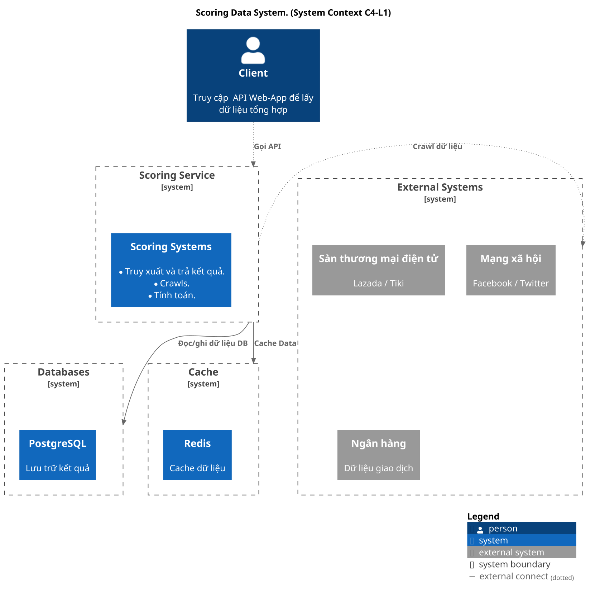
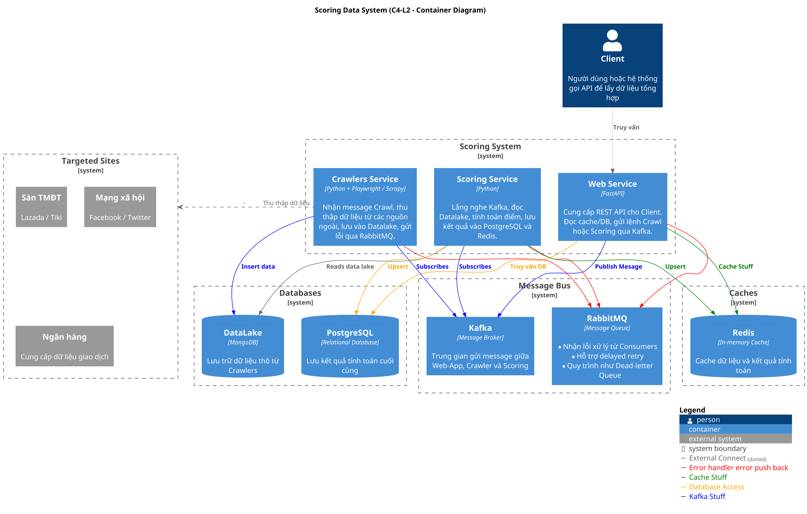
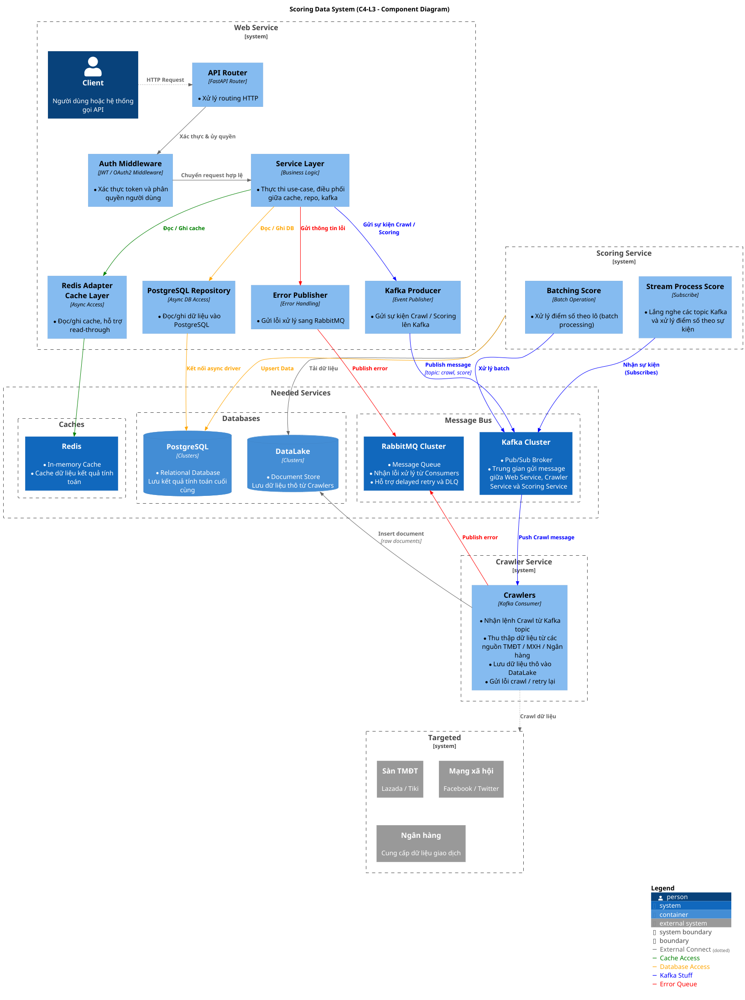

# I. Architecture & Implementation

## 1. Sơ đồ Kiến trúc Hệ thống (High-level Diagram)

---

## 2. Chiến lược Crawler & Xử lý song song
    
- **Chi tiết triển khai:**
  - Triển khai mutilple Crawler.
  - Xây dựng interfaces tách biệt theo từng lĩnh vực
  - Mỗi một trang là một crawler.
  - Tận dụng cơ chế I/O concurrency bằng `asyncio` để tối đa hiệu suất khi crawl dữ liệu.
  
- **Cơ chế bổ trợ:**
  - **Workflow Orchestration** quản lý lập lịch tập trung, linh hoạt theo nhu cầu.
  - **Retry** với exponential backoff cho các request thất bại.
  - **Error handling** linh hoạt để đảm bảo hệ thống không dừng đột ngột.
  - **Rate limiting** nhằm tránh bị chặn hoặc quá tải từ phía server nguồn.
  - **Delayed job** phát sinh trong quá trình crawl, thực thi lại sau.
    
---

## 3. Giải pháp Tối ưu Hiệu năng
- **Message Bus:**
  - Sử dụng Kafka Cluster như tổng đài để làm nơi tiếp nhận và điều phối các messages.
  - Chia nhỏ topics theo tiền tố dịch vụ.
  
- **Caching:**
  - Sử dụng **Redis Cluster** hoặc **MemCache** như một database song song có chứa dữ liệu đã được tính toán (*user_id* là keys).

- **Message Queue:**
  - Dùng hàng đợi RabbitMQ để thay thế cho DeadLetterQueue trường hợp Kafka down sau khi Consumer đã nhận Message.
  
- **Database:**
  - Sử dụng Cluster có polling điều hướng read/write.
  - Chia nhỏ theo từng services triển khai theo hướng mico-services.

- **Network:**
  - Sử dụng chung 1 Network để giảm độ trễ.
---

# II. Results & Scalability

## 4. Chỉ số Hiệu năng (Sẽ show loadtest result khi demo.)
<!-- todo:1 demo --> 
- **Throughput:** 
- **Latency:** 
- **CPU & Memory usage:** 

---

## 5. Phân tích Khả năng Mở rộng
- **Horizontal scaling:**
  - Lựa chọn hạ tầng có thể scale node.
  - Cần Stateless architecture giúp dễ dàng scale-out.
  - Có thể sử dụng **KEDA** để quản lý ScaleObjects.

- **Service Scale:**
  - Sử dụng **Helm** để quản lý *Release* và *dịch vụ* vìtrong quá trình phát triển và vận hành hoàn toàn có thể phát sinh dịch vụ mới, nên không quản lý manifest bằng file YAML sẽ tốn thời gian hơn.  
- **Load testing:** 
  - DEMO <!-- todo:2  demo --> 

---

## 6. Đánh đổi & Cải tiến Tương lai
- **Giải thích các quyết định kỹ thuật:**
  - Ưu tiên async để giảm thread/process.
  - Dùng message queue nhằm tăng khả năng chịu lỗi và tách biệt trách nhiệm.

- **Các giới hạn hiện tại:**
  - I/O bottleneck khi crawl khối lượng lớn dữ liệu.
  - Cần cải tiến auto-scaling, retry policy động, và cơ chế giám sát tập trung trong tương lai.
